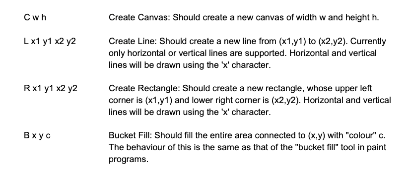
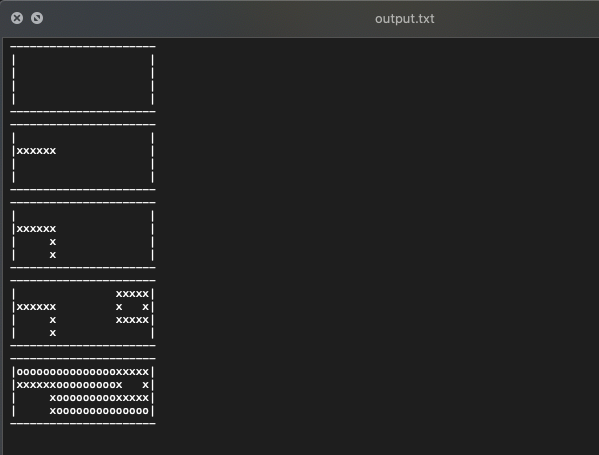

# Python Drawing Tool

In a nutshell, the program reads the input.txt, executes a set of commands from the file, 
step by step, and produces output.txt.

At this time, the functionality of the program is quite limited but this might change in the future.
At the moment, the program should support the following set of commands.



## The Output should be something like this



## Getting Started

These instructions will get you a copy of the project up and running on your local machine 
for development and testing purposes.

### Prerequisites

To run this project you need to install Python3.5 or higher. You don't need extra packages. 
However, to run the tests you should install flake8.

Manually:
```
pip install --upgrade pip
pip install flake8
```

From Requirements File:
```
pip install -f requirements.txt
```

That's it!.

## Running the tests

To run the tests run the command as follows:

python -m unittest -b && flake8

### Break down into end-to-end tests

There are a couple of unit test that can help you test the program if you modify or refactor the components.
There are tests for the components, validations, constraints, etc.

Example:
```
    def test_draw_to_canvas(self):
        """Test to draw a rectangle on canvas"""
        x1, y1, x2, y2 = 1, 1, 3, 3
        rectangle = Rectangle(x1, y1, x2, y2)
        rectangle.draw_to_canvas()

        exp = [
            ['x', 'x', 'x', ' ', ' '],
            ['x', ' ', 'x', ' ', ' '],
            ['x', 'x', 'x', ' ', ' '],
            [' ', ' ', ' ', ' ', ' ']
        ]
        self.assertEqual(exp, self.canvas.canvasArray)
```

## Built With

* [Python](https://www.python.org/) - The Language used

## Authors

* **David Gomez** - *Initial work* - https://github.com/davidgomezcol/python-drawing-tool

## License

This project is licensed under the MIT License - see the [LICENSE.md](LICENSE.md) file for details
